# Chapter 3: System Design

---

## 3.1 System Design Overview

Following the detailed analysis presented in Chapter 2, this chapter translates the functional and non-functional requirements of AALMAS (Academic Assessment Load & Performance Analysis System) into a concrete system design. The design phase serves as the architectural blueprint that bridges the gap between *what* the system must do and *how* it will accomplish those goals. It addresses the internal structure, behavioral workflows, user-interface standards, and data-storage schema that collectively define the system.

AALMAS employs a **three-tier web application architecture** consisting of:

| Tier | Technology | Responsibility |
|------|-----------|---------------|
| **Presentation Tier** | HTML5, CSS3, Bootstrap 5, JavaScript, Chart.js | Renders the user interface; handles client-side validation and charting |
| **Application Tier** | PHP 8+ (procedural with modular includes) | Implements business logic: authentication, risk-score calculation, role-based access control, grade processing, notification dispatching |
| **Data Tier** | MySQL 8 (InnoDB engine, utf8mb4) | Stores all persistent data: users, courses, sections, assessments, grades, alerts, notifications, contact requests, and activity logs |

The system follows a **role-based modular structure** in which each user role (Admin, Faculty, Advisor, Student) is served by a dedicated directory of PHP files sharing common reusable components (header, sidebar, topbar, footer, and utility functions). This separation ensures that access control is enforced at both the file-system and application levels.

Key architectural decisions include:

- **Session-based authentication** with configurable timeout (default 30 minutes) and role-based redirect logic.
- **PDO-based database access** with prepared statements to prevent SQL injection.
- **Automated risk-score engine** that evaluates four weighted factors—grade average (40 %), grade trend (25 %), assessment load (20 %), and missing/zero scores (15 %)—to classify each student into one of four risk levels: *Stable*, *Needs Monitoring*, *At Risk*, or *High Risk*.
- **Real-time notification system** that creates in-app alerts when grades are posted, workloads spike, or performance declines.

The following sections present the behavioral modeling (activity and sequence diagrams), the interface design specifications, and the database design, providing a complete picture of the system before implementation.

---

## 3.2 Activity Diagrams

Activity diagrams model the dynamic workflows within AALMAS. They illustrate the sequential and parallel steps that occur during key system processes, clearly showing decision points, actor responsibilities, and system responses.

### 3.2.1 Activity Diagram — Login and Authentication

This diagram models the complete authentication workflow, from entering credentials through role-based redirection to the appropriate dashboard.

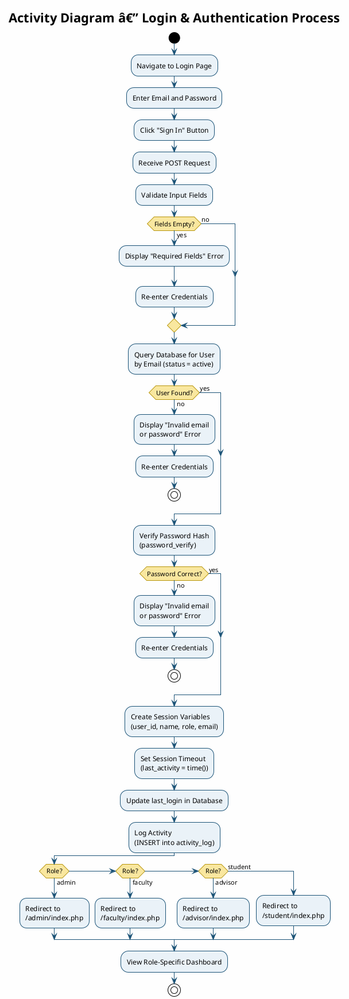

---

### 3.2.2 Activity Diagram — Grade Entry and Risk Detection

This diagram captures the workflow when a faculty member enters grades for an assessment, triggering the automated risk-score recalculation and academic-alert generation.

```plantuml
@startuml AD_Grade_Entry_Risk
!theme plain
skinparam backgroundColor #FEFEFE
skinparam ActivityBackgroundColor #EAF2F8
skinparam ActivityBorderColor #1A5276
skinparam ActivityDiamondBackgroundColor #F9E79F
skinparam ActivityDiamondBorderColor #B7950B
skinparam ArrowColor #1A5276
skinparam ActivityStartColor #000000
skinparam ActivityEndColor #000000
skinparam ActivityBarColor #000000

title **Activity Diagram — Grade Entry & Risk Detection**


start
:Navigate to Grade Entry Page;
:Select Section and Assessment;
:Enter Scores for Each Student;
:Click "Save Grades";

:Validate Score Values\n(0 ≤ score ≤ max_score);

if (Validation Passed?) then (no)
  :Display Validation Error;
  :Correct Invalid Scores;
else (yes)
endif

:INSERT / UPDATE Grades\nin grades Table;
:Update Assessment Status\nto "graded";
:Log Grade Entry Activity;

fork
  :Recalculate Risk Score\nfor Each Graded Student;

  note right
    **Risk Score Formula:**
    Grade Average أ— 0.40
    + Grade Trend أ— 0.25
    + Load Score أ— 0.20
    + Missing Score أ— 0.15
  end note

  if (Risk Score < 60?) then (yes)
    :Generate Academic Alert\n(severity = danger / critical);
    :INSERT into academic_alerts;
  else if (Risk Score < 70?) then (yes)
    :Generate Academic Alert\n(severity = warning);
    :INSERT into academic_alerts;
  else (no)
    :No Alert Needed;
  endif

fork again
  :Create Grade Notification\nfor Each Student;
  :INSERT into notifications;
fork end

:Receive "New Grade Posted"\nNotification;
:View Updated Grades &\nRisk Status on Dashboard;

:View Updated Risk\nDistribution on Dashboard;

if (Critical Alerts Exist?) then (yes)
  :Review At-Risk Students;
  :Take Intervention Action;
else (no)
endif

stop

@enduml
```

---

### 3.2.3 Activity Diagram — Student–Advisor Contact Request

This diagram illustrates the full lifecycle of a contact request from submission through advisor review, reply, and closure.

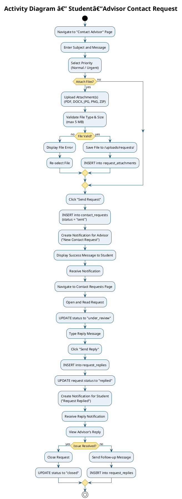

---

### 3.2.4 Activity Diagram — Admin Module

This diagram shows the complete set of activities available to the system administrator, including user management, course management, monitoring, and system configuration.

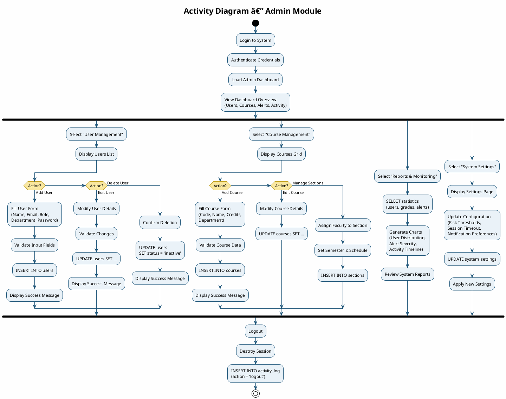

**Figure 3.1: Admin Activity Diagram**

---

### 3.2.5 Activity Diagram — Faculty Module

This diagram presents all activities available to the faculty member, including section management, assessment creation, grade entry, and student performance monitoring.

```plantuml
@startuml AD_Faculty_Module
!theme plain
skinparam backgroundColor #FEFEFE
skinparam ActivityBackgroundColor #EAF2F8
skinparam ActivityBorderColor #1A5276
skinparam ActivityDiamondBackgroundColor #F9E79F
skinparam ActivityDiamondBorderColor #B7950B
skinparam ArrowColor #1A5276
skinparam ActivityStartColor #000000
skinparam ActivityEndColor #000000
skinparam ActivityBarColor #000000

title **Activity Diagram — Faculty Module**


start
:Login to System;

:Authenticate Credentials;
:Load Faculty Dashboard;

:View Dashboard Overview\n(Sections, Students,\nAssessments, Pending Grades);

fork
  :Select "My Sections";

  :SELECT sections\nWHERE faculty_id = ?;
  :Display Sections List;

  :Select a Section;

  :SELECT enrolled students\nFROM section_students;
  :Display Student Roster\nwith Enrollment Details;

fork again
  :Select "Assessments";

  :Display Assessments List;

  if (Action?) then (Create New)
    :Fill Assessment Form\n(Title, Type, Max Score,\nWeight %, Due Date);
    :Validate Assessment Data\n(Total weight ≤ 100%);
    if (Validation OK?) then (yes)
      :INSERT INTO assessments;
      :Display Success Message;
    else (no)
      :Display Weight Error;
      :Adjust Weight Percentage;
    endif
  else (Edit Existing)
    :Modify Assessment Details;
    :UPDATE assessments SET ...;
  endif

fork again
  :Select "Grade Entry";

  :Display Grade Entry Form\n(Section → Assessment → Students);

  :Enter Scores for\nEach Student;
  :Click "Save Grades";

  :Validate Scores\n(0 ≤ score ≤ max_score);

  if (All Scores Valid?) then (yes)
    :INSERT/UPDATE grades;
    :UPDATE assessment\nstatus = 'graded';

    :Recalculate Risk Scores\nfor Graded Students;

    if (Risk Score < 70?) then (yes)
      :INSERT INTO academic_alerts;
    else (no)
    endif

    :INSERT INTO notifications\n(type = 'grade');

    :Receive Grade Notification;

  else (no)
    :Display Validation Errors;
    :Correct Invalid Scores;
  endif

fork again
  :Select "Student Performance";

  :SELECT grades, risk scores\nfor faculty's students;
  :Display Performance Table\n(Average, Trend, Risk Level);

  :Review At-Risk Students;
  :Export Performance Report;

fork end

:Logout;
stop

@enduml
```

**Figure 3.2: Faculty Activity Diagram**

---

### 3.2.6 Activity Diagram — Advisor Module

This diagram covers the advisor's activities including monitoring assigned students, reviewing academic alerts, managing contact requests, and writing academic notes.

```plantuml
@startuml AD_Advisor_Module
!theme plain
skinparam backgroundColor #FEFEFE
skinparam ActivityBackgroundColor #EAF2F8
skinparam ActivityBorderColor #1A5276
skinparam ActivityDiamondBackgroundColor #F9E79F
skinparam ActivityDiamondBorderColor #B7950B
skinparam ArrowColor #1A5276
skinparam ActivityStartColor #000000
skinparam ActivityEndColor #000000
skinparam ActivityBarColor #000000

title **Activity Diagram — Advisor Module**


start
:Login to System;

:Authenticate Credentials;
:Load Advisor Dashboard;

:View Dashboard Overview\n(Assigned Students,\nAt-Risk Count, Pending Requests,\nUnread Alerts);

fork
  :Select "My Students";

  :SELECT students\nFROM advisor_assignments\nWHERE advisor_id = ?;

  :SELECT risk scores\nfor each assigned student;
  :Display Student List\nwith Risk Badges\nand Performance Indicators;

  :Select a Student;

  :Display Student Profile\n(Grades, Risk History,\nCourse Performance);

  if (Intervention Needed?) then (yes)
    :Write Academic Note\n(Type: warning /\nrecommendation / follow_up);
    :INSERT INTO academic_notes;
  else (no)
  endif

fork again
  :Select "Academic Alerts";

  :SELECT academic_alerts\nWHERE student_id IN\n(assigned students)\nORDER BY severity DESC;
  :Display Alert Cards\n(grouped by severity:\ncritical → danger →\nwarning → info);

  :Review Alert Details;

  if (Alert Resolved?) then (yes)
    :Click "Resolve Alert";
    :UPDATE academic_alerts\nSET is_resolved = 1;
    :Display Success Message;
  else (no)
    :Take Note for Follow-up;
  endif

fork again
  :Select "Contact Requests";

  :SELECT contact_requests\nWHERE advisor_id = ?;
  :Display Requests List\nwith Status Badges;

  :Open a Request;

  :UPDATE status\n= 'under_review';

  :Read Student Message;
  :Type Reply;
  :Click "Send Reply";

  :INSERT INTO request_replies;
  :UPDATE request status\n= 'replied';
  :INSERT INTO notifications\n(type = 'request');

  :Receive Reply Notification;
  :View Advisor's Reply;

  if (Issue Resolved?) then (yes)
    :Close Request;
    :UPDATE status = 'closed';
  else (no)
    :Await Follow-up;
  endif

fork again
  :Select "Reports";

  :SELECT performance data\nfor assigned students;
  :Generate Risk Distribution\nChart and Performance\nSummary Tables;

  :Review Reports;
  :Export Report (if needed);

fork end

:Logout;
stop

@enduml
```

**Figure 3.3: Advisor Activity Diagram**

---

### 3.2.7 Activity Diagram — Student Module

This diagram illustrates all activities available to the student, including viewing grades, checking risk status, managing alerts, contacting the advisor, and viewing workload.

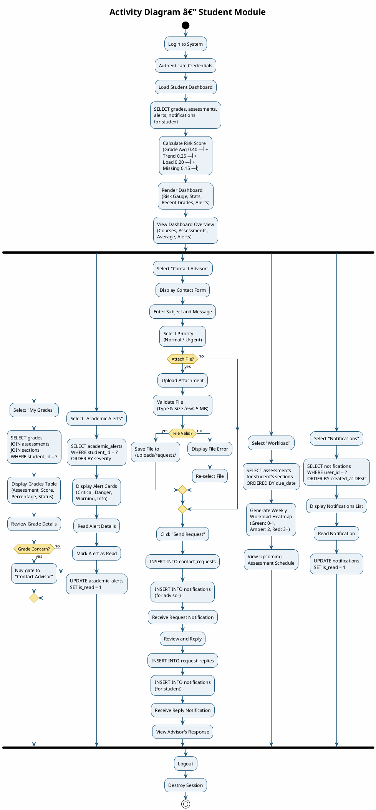

**Figure 3.4: Student Activity Diagram**

---

## 3.3 Sequence Diagrams

Sequence diagrams complement the activity diagrams by emphasizing the chronological order of messages exchanged between actors and system components. They highlight the interaction between the Presentation Tier, the Application Tier, and the Data Tier.

### 3.3.1 Sequence Diagram — User Authentication

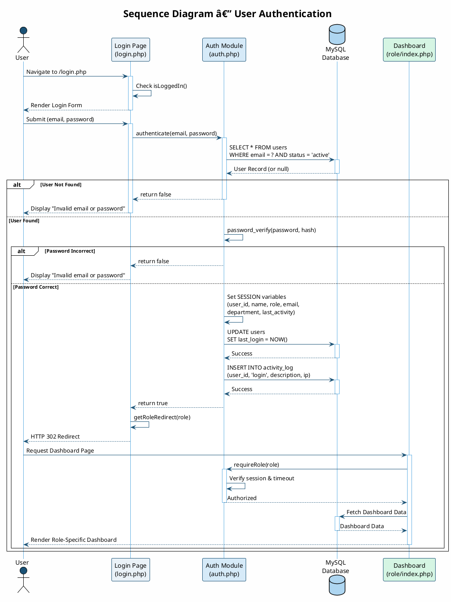

---

### 3.3.2 Sequence Diagram — Assessment Grading Workflow

```plantuml
@startuml SD_Grading
!theme plain
skinparam backgroundColor #FEFEFE
skinparam ParticipantBackgroundColor #EAF2F8
skinparam ParticipantBorderColor #1A5276
skinparam SequenceArrowColor #1A5276
skinparam SequenceLifeLineBorderColor #5DADE2
skinparam NoteBackgroundColor #D5F5E3
skinparam SequenceBoxBackgroundColor #F4F4F8

title **Sequence Diagram — Assessment Grading Workflow**

actor "Faculty" as F #1A5276
participant "Grade Entry Page\n(faculty/grades.php)" as GP #EAF2F8
participant "Functions Module\n(functions.php)" as FM #D6EAF8
database "MySQL\nDatabase" as DB #AED6F1
actor "Student" as S #E67E22

F -> GP : Navigate to Grade Entry
activate GP
GP -> DB : SELECT sections\nWHERE faculty_id = ?
activate DB
DB --> GP : Faculty's Sections
deactivate DB
GP --> F : Display Sections List
deactivate GP

F -> GP : Select Section & Assessment
activate GP
GP -> DB : SELECT students + existing grades\nfor assessment_id
activate DB
DB --> GP : Student list with scores
deactivate DB
GP --> F : Display Grade Entry Form
deactivate GP

F -> GP : Enter/Update Scores
F -> GP : Submit Grades
activate GP

loop For Each Student Score
    GP -> GP : Validate\n(0 ≤ score ≤ max_score)
    GP -> DB : INSERT INTO grades\n(assessment_id, student_id, score)\nON DUPLICATE KEY UPDATE
    activate DB
    DB --> GP : Success
    deactivate DB
end

GP -> DB : UPDATE assessments\nSET status = 'graded'
activate DB
DB --> GP : Success
deactivate DB

GP -> DB : INSERT INTO activity_log
activate DB
DB --> GP : Success
deactivate DB

loop For Each Graded Student
    GP -> FM : calculateRiskScore(student_id)
    activate FM
    FM -> DB : SELECT grades + assessments\nfor student
    activate DB
    DB --> FM : Grade Records
    deactivate DB
    FM -> FM : Compute weighted risk score\n(Grade Avg أ— 0.40\n+ Trend أ— 0.25\n+ Load أ— 0.20\n+ Missing أ— 0.15)
    FM --> GP : Risk Score & Level
    deactivate FM

    alt Risk Level = "at_risk" or "high_risk"
        GP -> DB : INSERT INTO academic_alerts\n(student_id, severity, message)
        activate DB
        DB --> GP : Success
        deactivate DB
    end

    GP -> FM : createNotification\n(student_id, 'grade', title, message)
    activate FM
    FM -> DB : INSERT INTO notifications
    activate DB
    DB --> FM : Success
    deactivate DB
    FM --> GP : Done
    deactivate FM
end

GP --> F : Display "Grades Saved Successfully"
deactivate GP
S -> S : View notification on next login

@enduml
```

---

### 3.3.3 Sequence Diagram — Academic Alert and Notification Flow

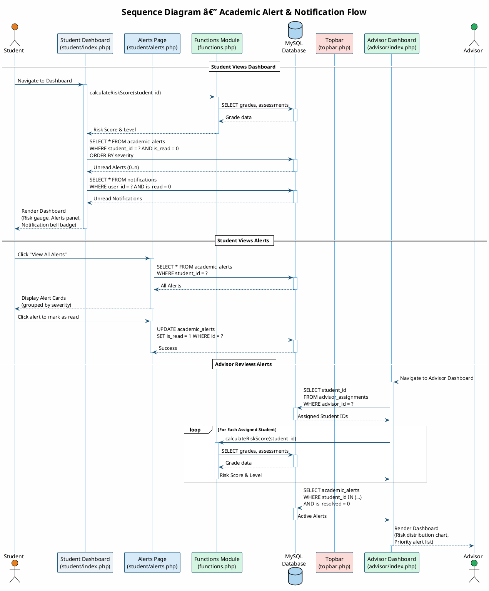

---

## 3.4 Interface Design

### 3.4.1 Logo

The AALMAS logo features a **shield icon** rendered in a gradient that transitions from deep navy (#0A1628) to sky blue (#5DADE2). The shield symbolizes academic protection and early intervention. The wordmark "AALMAS" is rendered in the Inter typeface at 800 weight with 2 px letter spacing, accompanied by the subtitle "Performance Analysis" in lighter weight. The logo is used consistently across the login page, the sidebar brand area, the landing-page navbar, and the browser tab favicon.

### 3.4.2 Style Guide — Typography

AALMAS uses a single-family typographic system based on **Inter**, a modern sans-serif typeface optimized for screen readability. The typeface is loaded from Google Fonts with the following weight range:

| Element | Weight | Size | Usage |
|---------|--------|------|-------|
| Page Headings (H1–H2) | 800 (Extra Bold) | 1.8 – 2.2 rem | Dashboard titles, section headings |
| Card Headers (H5–H6) | 700 (Bold) | 0.95 – 1.05 rem | Card titles, panel headers |
| Body Text | 400 – 500 | 0.85 rem (14 px base) | Paragraphs, table cells, form labels |
| Small / Caption | 400 | 0.65 – 0.75 rem | Timestamps, sub-labels, badges |
| Navigation Links | 500 (Medium) | 0.875 rem | Sidebar links, topbar items |
| Stat Values | 800 (Extra Bold) | 1.8 rem | Dashboard KPI numbers |
| Code / IDs | Monospace (system) | 0.8 rem | University IDs, technical identifiers |

**Line height** is set globally to 1.6 for comfortable reading. **Letter spacing** is applied at 1.5 px for uppercase section labels and 0.5 px for table headers to enhance scannability. The system uses `-webkit-font-smoothing: antialiased` for crisp rendering on all platforms.

### 3.4.3 Style Guide — Color Palette

The AALMAS design system is built on a carefully curated **Navy-to-Sky-Blue primary palette** derived from the logo, complemented by semantic status colors and neutral grays.

#### Primary Palette (Brand Identity)

| Token | Hex Code | Usage |
|-------|----------|-------|
| Primary 900 | `#0A1628` | Sidebar background (darkest), footer |
| Primary 800 | `#0F2744` | Sidebar gradient mid-point |
| Primary 700 | `#143A5C` | Sidebar gradient end, hero section |
| Primary 600 | `#1A5276` | Headings, dark accents |
| Primary 500 | `#1E6FA0` | Primary buttons, active states, chart colors |
| Primary 400 | `#2E86C1` | Links, interactive elements |
| Primary 300 | `#5DADE2` | Sidebar active indicators, gradient endpoints |
| Primary 200 | `#85C1E9` | Secondary text on dark backgrounds |
| Primary 100 | `#AED6F1` | Light backgrounds |
| Primary 50  | `#D6EAF8` | Very light tints, hover states |
| Primary 25  | `#EAF2F8` | Table row hover, subtle backgrounds |

#### Accent Color

| Token | Hex Code | Usage |
|-------|----------|-------|
| Accent | `#00D4AA` | Call-to-action buttons, hero section highlights |
| Accent Dark | `#00B894` | Accent hover state |
| Accent Light | `#55EFC4` | Gradient end points |

#### Semantic / Status Colors

| Token | Hex Code | Meaning |
|-------|----------|---------|
| Success | `#27AE60` | Stable risk, positive actions, high grades |
| Warning | `#F39C12` | Needs monitoring, moderate risk |
| Orange | `#E67E22` | At-risk status |
| Danger | `#E74C3C` | High risk, critical alerts, failing grades |
| Info | `#3498DB` | Informational badges, quiz indicators |

#### Risk-Level Mapping

| Level | Color | Threshold | Visual Treatment |
|-------|-------|-----------|-----------------|
| Stable | `#27AE60` (Green) | Score ≥ 80 | Green badge with check-circle icon |
| Needs Monitoring | `#F39C12` (Amber) | Score 70–79 | Amber badge with eye icon |
| At Risk | `#E67E22` (Orange) | Score 60–69 | Orange badge with exclamation-triangle icon |
| High Risk | `#E74C3C` (Red) | Score < 60 | Red badge with times-circle icon |

#### Neutral Palette

| Token | Hex Code | Usage |
|-------|----------|-------|
| Gray 900 | `#1A1A2E` | Primary text color |
| Gray 600 | `#6C6C8A` | Secondary text, descriptions |
| Gray 200 | `#E8E8F0` | Borders, dividers |
| Gray 100 | `#F4F4F8` | Page background |
| Gray 50  | `#FAFAFC` | Alternating row backgrounds |

#### Gradient Cards (Dashboard Stats)

| Gradient | Start → End | Usage |
|----------|-------------|-------|
| Gradient 1 | `#1E6FA0` → `#5DADE2` | Users / Courses stat cards |
| Gradient 2 | `#27AE60` → `#55EFC4` | Success / Active stat cards |
| Gradient 3 | `#E67E22` → `#F39C12` | Warning / Pending stat cards |
| Gradient 4 | `#E74C3C` → `#FD79A8` | Danger / Alert stat cards |

### 3.4.4 Interface Prototype Descriptions

The AALMAS interface is composed of **nine key prototype screens** that collectively represent the system's user-facing design. The public-facing pages (Landing, Login, Forgot Password) use a standalone full-screen layout, while all authenticated pages follow a consistent **sidebar + topbar + content area** architecture. Below is a description of each prototype screen.

#### A) Landing Page

The landing page serves as the public-facing entry point of AALMAS. It opens with a **fixed-position transparent navbar** that gains a frosted-glass backdrop (`backdrop-filter: blur(20px)`) and a subtle drop shadow on scroll. The navbar contains the AALMAS logo, anchor links to in-page sections (Features, Users, How It Works), and a gradient "Sign In" call-to-action button. The **hero section** occupies the full viewport height with a five-stop primary gradient background (900 → 800 → 700 → 600 → 500) overlaid with radial glows for depth, and a floating particle animation of small dots drifting upward. The left column presents a hero badge, a large 900-weight headline with a gradient-text accent span, a descriptive subtitle paragraph, and two action buttons (a teal gradient "Get Started" primary button and a transparent outlined "Explore Features" button). The right column displays a glassmorphism hero card (`background: rgba(255,255,255,.06)`) containing animated stat counters (Detection Rate, Risk Levels, Live Monitoring) and color-coded risk-level badges, with a floating AALMAS logo animated using a vertical bob-and-rotate keyframe. Below the hero, a **Features section** on a light gray background (`#FAFAFC`) presents six feature cards in a 3أ—2 grid, each with a color-coded icon container (blue, green, red, orange, purple, teal), a bold title, and a description paragraph; cards lift with `translateY(-8px)` on hover and reveal a top gradient border via a `scaleX` transition. Next, a **Users section** displays four user-role columns (Admin, Faculty, Advisor, Student), each with a gradient circular icon, role title, description, and a bullet list of role capabilities. A **How It Works** section shows four numbered step cards in a horizontal sequence. The page concludes with a **CTA section** on a dark gradient background prompting visitors to sign in, and a **footer** containing the brand identity, quick links, and a copyright bar.

#### B) Login Page

The login page features a centered authentication card over a full-screen animated background. Floating geometric shapes provide subtle motion through CSS animations. The card includes the AALMAS logo, a glassmorphism-styled card body with floating-label email and password inputs, a gradient "Sign In" button, a "Forgot Password?" link, and demo credential hints. The background uses the full primary gradient (900 → 500) with radial glow overlays for depth.

#### C) Forgot Password Page

The forgot password page reuses the same full-screen authentication wrapper and animated floating-shape background as the login page for visual consistency. The centered card displays a large **key icon** (`fa-key`) inside a gradient circular container, a "Forgot Password" heading, and a brief instruction ("Enter your email to receive a reset link"). Below the header, context-sensitive alert banners appear: an error alert (red) for invalid or missing emails, and a success alert (green) when a reset link is generated. In demo mode, the generated reset token URL is displayed in a highlighted "Demo Reset Link" box with a clickable link styled in the primary-500 color. The form contains a single floating-label email input with an envelope icon and a gradient "Send Reset Link" button (`fa-paper-plane` icon). A "Back to Login" link with a left-arrow icon sits beneath the form, and the card closes with a centered copyright footer. The page imports the shared `auth.css` stylesheet, ensuring identical glassmorphism card styling, input focus transitions, and button gradient hover effects as the login page.

#### D) Admin Dashboard

The admin dashboard presents four gradient stat cards at the top showing Total Users, Active Courses, Active Sections, and Active Alerts. Below, a three-column row contains: (1) a doughnut chart of users by role, (2) a bar chart of alerts by severity, and (3) a quick-overview panel listing key counts (Students, Faculty, Assessments, Contact Requests, Grades Entered). A second row provides Quick Action buttons (Add User, Add Course, View Reports, Settings) and a Recent Activity timeline with color-coded dots.

#### E) Faculty Dashboard

The faculty dashboard displays stat cards for Total Sections, Total Students, Assessments Created, and Pending Grades. It includes a section list view, an assessment management panel with type-specific colored badges (quiz → blue, midterm → purple, final → red, project → green, assignment → amber), and a grade entry form with tabular score input. The Student Performance page renders per-student risk badges and progress bars.

#### F) Course Management Page (Admin)

The course management page provides admin users with a complete CRUD interface for managing the institution's course catalog. The page header contains a bold title with a book icon ("Course Management") and an "Add Course" primary button that opens a Bootstrap 5 modal form. Courses are displayed as a **responsive card grid** (three columns on large screens, two on medium) where each card shows: the course code in a prominent badge-style element, an active/inactive status badge (green for active, gray for inactive), the course name, credit hours (with a clock icon), department (with a building icon), and the count of active sections (with a layer-group icon). Each card footer provides an "Edit" outline button and a "Delete" outline-danger button (with a confirmation dialog). The **modal form** adapts dynamically for both Add and Edit operations—switching its title, hidden action field, and pre-populating inputs via JavaScript. Form fields include Course Code (text, required), Course Name (text, required), Credit Hours (number input, default 3, range 1–6), Status (select dropdown: Active/Inactive), Department (text), and Description (textarea). On form submission, the server-side handler validates and executes the corresponding INSERT, UPDATE, or DELETE query using PDO prepared statements, sets a flash success message, and redirects back to the page. The flash message appears as a dismissible Bootstrap alert at the top of the content area.

#### G) Advisor Dashboard

The advisor dashboard shows Assigned Students, At-Risk Students, Pending Requests, and Unread Alerts as stat cards. The main area features a doughnut chart of student risk distribution (Stable/Monitor/At Risk/High Risk) and a tabular student list with avatar initials, university ID, average grade, trend arrows (↑ improving / ↓ declining / — stable), and risk badges. Below, two columns display Priority Alerts (sorted by severity with color-coded cards) and Recent Contact Requests with status badges (Sent → blue, Under Review → amber, Replied → green, Closed → gray).

#### H) Academic Alerts Page (Advisor)

The academic alerts page gives advisors a consolidated view of all academic alerts for their assigned students, sorted by priority. The page heading displays a bell icon with the title "Academic Alerts." Alerts are rendered as **vertically stacked cards**, each styled with a left-border color indicator matching its severity level (critical → red, danger → dark red, warning → amber, info → blue). Each alert card contains: a **student avatar circle** showing initials (36 أ— 36 px), the alert title in bold, the alert message in secondary text, and a metadata row displaying the student name and university ID (user icon), the related course code (book icon), and the relative timestamp (clock icon, e.g., "2 hours ago"). On the right side of each card, a **severity badge** with an appropriate icon indicates the alert level (Critical, Danger, Warning, Info). Unresolved alerts display a green outline "Resolve" button (check icon) that submits a POST request to mark the alert as resolved (`is_resolved = 1, is_read = 1`); resolved alerts instead show a gray "Resolved" badge and the entire card renders at 50 % opacity to visually distinguish it from active alerts. Alerts are sorted with unresolved alerts first, then by severity (critical → danger → warning → info), and finally by creation date descending. Flash success messages appear in a dismissible green alert banner when an alert is resolved.

#### I) Student Dashboard

The student dashboard presents four stat cards: Registered Courses, Upcoming Assessments, Overall Average (with trend indicator), and Unread Alerts. The Academic Status card shows a circular risk gauge with the numerical score and a risk-level label. A radar chart visualizes performance percentage across all enrolled courses. The lower section contains three columns: Recent Grades (with score/percentage display), Upcoming Assessments (with countdown timer), and Active Alerts (grouped by severity). The Workload page provides a weekly heatmap bar chart color-coded by density (green = 0–1, amber = 2, red = 3+).

---

## 3.5 Database Design

### 3.5.1 Entity Relationship Diagram (ERD)

The AALMAS database (`aalmas_db`) consists of **14 interrelated tables** using the InnoDB storage engine with `utf8mb4` character encoding. The following ERD captures all entities, their attributes, primary keys, and relationships.

```plantuml
@startuml ERD_AALMAS
!theme plain
skinparam backgroundColor #FEFEFE
skinparam ClassBackgroundColor #EAF2F8
skinparam ClassBorderColor #1A5276
skinparam ClassHeaderBackgroundColor #1A5276
skinparam ClassFontColor #1A1A2E
skinparam ArrowColor #1A5276
skinparam defaultFontName Inter

title **Entity Relationship Diagram (ERD) — AALMAS Database**

entity "users" as users {
  * **id** : INT <<PK, AUTO_INCREMENT>>
  --
  * user_id : VARCHAR(20) <<UNIQUE>>
  * name : VARCHAR(100)
  * email : VARCHAR(150) <<UNIQUE>>
  * password : VARCHAR(255)
  * role : ENUM('admin','faculty','advisor','student')
  phone : VARCHAR(20)
  department : VARCHAR(100)
  avatar : VARCHAR(255)
  * status : ENUM('active','inactive')
  last_login : DATETIME
  * created_at : TIMESTAMP
  * updated_at : TIMESTAMP
}

entity "password_resets" as pw_reset {
  * **id** : INT <<PK>>
  --
  * user_id : INT <<FK → users.id>>
  * token : VARCHAR(255)
  * expires_at : DATETIME
  used : TINYINT(1)
  * created_at : TIMESTAMP
}

entity "courses" as courses {
  * **id** : INT <<PK>>
  --
  * code : VARCHAR(20) <<UNIQUE>>
  * name : VARCHAR(150)
  * credit_hours : INT
  department : VARCHAR(100)
  description : TEXT
  * status : ENUM('active','inactive')
  * created_at : TIMESTAMP
}

entity "sections" as sections {
  * **id** : INT <<PK>>
  --
  * course_id : INT <<FK → courses.id>>
  * section_number : VARCHAR(10)
  * faculty_id : INT <<FK → users.id>>
  * semester : VARCHAR(20)
  * academic_year : VARCHAR(9)
  max_students : INT
  schedule : VARCHAR(100)
  room : VARCHAR(50)
  * status : ENUM('active','completed','cancelled')
  * created_at : TIMESTAMP
}

entity "section_students" as sec_stu {
  * **id** : INT <<PK>>
  --
  * section_id : INT <<FK → sections.id>>
  * student_id : INT <<FK → users.id>>
  * enrolled_at : TIMESTAMP
  ..
  <<UNIQUE(section_id, student_id)>>
}

entity "assessments" as assessments {
  * **id** : INT <<PK>>
  --
  * section_id : INT <<FK → sections.id>>
  * title : VARCHAR(150)
  * type : ENUM('quiz','midterm','final',\n  'project','assignment','presentation',\n  'lab','participation')
  * max_score : DECIMAL(5,2)
  * weight_percentage : DECIMAL(5,2)
  * due_date : DATE
  description : TEXT
  * status : ENUM('upcoming','active',\n  'graded','cancelled')
  * created_by : INT <<FK → users.id>>
  * created_at : TIMESTAMP
  * updated_at : TIMESTAMP
}

entity "grades" as grades {
  * **id** : INT <<PK>>
  --
  * assessment_id : INT <<FK → assessments.id>>
  * student_id : INT <<FK → users.id>>
  score : DECIMAL(5,2)
  remarks : TEXT
  * entered_by : INT <<FK → users.id>>
  * entered_at : TIMESTAMP
  * updated_at : TIMESTAMP
  ..
  <<UNIQUE(assessment_id, student_id)>>
}

entity "advisor_assignments" as adv_assign {
  * **id** : INT <<PK>>
  --
  * student_id : INT <<FK → users.id>>
  * advisor_id : INT <<FK → users.id>>
  * assigned_at : TIMESTAMP
  * status : ENUM('active','inactive')
  ..
  <<UNIQUE(student_id, advisor_id)>>
}

entity "contact_requests" as con_req {
  * **id** : INT <<PK>>
  --
  * student_id : INT <<FK → users.id>>
  * advisor_id : INT <<FK → users.id>>
  * subject : VARCHAR(255)
  * message : TEXT
  * priority : ENUM('normal','urgent')
  * status : ENUM('sent','under_review',\n  'replied','closed')
  * created_at : TIMESTAMP
  * updated_at : TIMESTAMP
}

entity "request_attachments" as req_attach {
  * **id** : INT <<PK>>
  --
  * request_id : INT <<FK → contact_requests.id>>
  * file_name : VARCHAR(255)
  * file_path : VARCHAR(500)
  file_size : INT
  file_type : VARCHAR(100)
  * uploaded_at : TIMESTAMP
}

entity "request_replies" as req_reply {
  * **id** : INT <<PK>>
  --
  * request_id : INT <<FK → contact_requests.id>>
  * user_id : INT <<FK → users.id>>
  * message : TEXT
  * created_at : TIMESTAMP
}

entity "notifications" as notif {
  * **id** : INT <<PK>>
  --
  * user_id : INT <<FK → users.id>>
  * type : ENUM('alert','grade','request',\n  'system','reminder')
  * title : VARCHAR(255)
  * message : TEXT
  link : VARCHAR(500)
  is_read : TINYINT(1)
  * created_at : TIMESTAMP
}

entity "academic_alerts" as alerts {
  * **id** : INT <<PK>>
  --
  * student_id : INT <<FK → users.id>>
  section_id : INT <<FK → sections.id>>
  * alert_type : ENUM('low_grade','high_workload',\n  'declining_trend','absence_risk',\n  'overdue_assessment')
  * severity : ENUM('info','warning',\n  'danger','critical')
  * title : VARCHAR(255)
  * message : TEXT
  is_read : TINYINT(1)
  is_resolved : TINYINT(1)
  * created_at : TIMESTAMP
}

entity "academic_notes" as notes {
  * **id** : INT <<PK>>
  --
  * student_id : INT <<FK → users.id>>
  * author_id : INT <<FK → users.id>>
  * note_type : ENUM('general','warning',\n  'recommendation','follow_up')
  * content : TEXT
  is_private : TINYINT(1)
  * created_at : TIMESTAMP
}

entity "system_settings" as settings {
  * **id** : INT <<PK>>
  --
  * setting_key : VARCHAR(100) <<UNIQUE>>
  setting_value : TEXT
  description : VARCHAR(255)
  * updated_at : TIMESTAMP
}

entity "activity_log" as act_log {
  * **id** : INT <<PK>>
  --
  user_id : INT <<FK → users.id>>
  * action : VARCHAR(100)
  description : TEXT
  ip_address : VARCHAR(45)
  * created_at : TIMESTAMP
}

' ===== Relationships =====
users ||--o{ pw_reset : "has"
users ||--o{ sections : "teaches (faculty_id)"
users ||--o{ sec_stu : "enrolls in (student_id)"
users ||--o{ grades : "receives (student_id)"
users ||--o{ grades : "enters (entered_by)"
users ||--o{ assessments : "creates (created_by)"
users ||--o{ adv_assign : "assigned as student"
users ||--o{ adv_assign : "assigned as advisor"
users ||--o{ con_req : "sends (student_id)"
users ||--o{ con_req : "receives (advisor_id)"
users ||--o{ req_reply : "replies"
users ||--o{ notif : "has"
users ||--o{ alerts : "has (student_id)"
users ||--o{ notes : "about (student_id)"
users ||--o{ notes : "writes (author_id)"
users ||--o{ act_log : "performs"

courses ||--o{ sections : "has"
sections ||--o{ sec_stu : "contains"
sections ||--o{ assessments : "has"
sections ||--o{ alerts : "triggers"
assessments ||--o{ grades : "has"

con_req ||--o{ req_attach : "has"
con_req ||--o{ req_reply : "has"

@enduml
```

---

### 3.5.2 UML Class Diagram

The following UML class diagram represents the logical data model of AALMAS, illustrating the classes (tables), their attributes, data types, and the multiplicity of relationships.

```plantuml
@startuml UML_Class_AALMAS
!theme plain
skinparam backgroundColor #FEFEFE
skinparam ClassBackgroundColor #EAF2F8
skinparam ClassBorderColor #1A5276
skinparam ClassHeaderBackgroundColor #1A5276
skinparam ClassHeaderFontColor #FFFFFF
skinparam ClassFontColor #1A1A2E
skinparam ArrowColor #1A5276
skinparam defaultFontName Inter

title **UML Class Diagram — AALMAS System**

class User {
  - id : int
  - user_id : string
  - name : string
  - email : string
  - password : string
  - role : enum{admin, faculty, advisor, student}
  - phone : string
  - department : string
  - avatar : string
  - status : enum{active, inactive}
  - last_login : datetime
  - created_at : timestamp
  - updated_at : timestamp
  __
  + authenticate(email, password) : bool
  + isLoggedIn() : bool
  + requireRole(roles[]) : void
  + getRoleRedirect(role) : string
  + getInitials() : string
  + logActivity(action, desc) : void
}

class PasswordReset {
  - id : int
  - user_id : int
  - token : string
  - expires_at : datetime
  - used : bool
  - created_at : timestamp
  __
  + generateResetToken(email) : string
  + validateResetToken(token) : object
  + resetPassword(token, newPass) : bool
}

class Course {
  - id : int
  - code : string
  - name : string
  - credit_hours : int
  - department : string
  - description : text
  - status : enum{active, inactive}
  - created_at : timestamp
}

class Section {
  - id : int
  - course_id : int
  - section_number : string
  - faculty_id : int
  - semester : string
  - academic_year : string
  - max_students : int
  - schedule : string
  - room : string
  - status : enum{active, completed, cancelled}
  - created_at : timestamp
  __
  + getEnrolledStudents() : Student[]
  + getAssessments() : Assessment[]
}

class SectionStudent {
  - id : int
  - section_id : int
  - student_id : int
  - enrolled_at : timestamp
}

class Assessment {
  - id : int
  - section_id : int
  - title : string
  - type : enum{quiz, midterm, final, project, assignment, presentation, lab, participation}
  - max_score : decimal
  - weight_percentage : decimal
  - due_date : date
  - description : text
  - status : enum{upcoming, active, graded, cancelled}
  - created_by : int
  - created_at : timestamp
  - updated_at : timestamp
  __
  + getGrades() : Grade[]
  + getAssessmentBadge() : object
}

class Grade {
  - id : int
  - assessment_id : int
  - student_id : int
  - score : decimal
  - remarks : text
  - entered_by : int
  - entered_at : timestamp
  - updated_at : timestamp
}

class AdvisorAssignment {
  - id : int
  - student_id : int
  - advisor_id : int
  - assigned_at : timestamp
  - status : enum{active, inactive}
}

class ContactRequest {
  - id : int
  - student_id : int
  - advisor_id : int
  - subject : string
  - message : text
  - priority : enum{normal, urgent}
  - status : enum{sent, under_review, replied, closed}
  - created_at : timestamp
  - updated_at : timestamp
  __
  + getAttachments() : RequestAttachment[]
  + getReplies() : RequestReply[]
  + getStatusBadge() : object
}

class RequestAttachment {
  - id : int
  - request_id : int
  - file_name : string
  - file_path : string
  - file_size : int
  - file_type : string
  - uploaded_at : timestamp
}

class RequestReply {
  - id : int
  - request_id : int
  - user_id : int
  - message : text
  - created_at : timestamp
}

class Notification {
  - id : int
  - user_id : int
  - type : enum{alert, grade, request, system, reminder}
  - title : string
  - message : text
  - link : string
  - is_read : bool
  - created_at : timestamp
  __
  + getUnreadCount(userId) : int
  + getRecent(userId, limit) : Notification[]
  + createNotification(userId, type, title, msg) : void
}

class AcademicAlert {
  - id : int
  - student_id : int
  - section_id : int
  - alert_type : enum{low_grade, high_workload, declining_trend, absence_risk, overdue_assessment}
  - severity : enum{info, warning, danger, critical}
  - title : string
  - message : text
  - is_read : bool
  - is_resolved : bool
  - created_at : timestamp
  __
  + getSeverityBadge() : object
}

class AcademicNote {
  - id : int
  - student_id : int
  - author_id : int
  - note_type : enum{general, warning, recommendation, follow_up}
  - content : text
  - is_private : bool
  - created_at : timestamp
}

class SystemSetting {
  - id : int
  - setting_key : string
  - setting_value : text
  - description : string
  - updated_at : timestamp
}

class ActivityLog {
  - id : int
  - user_id : int
  - action : string
  - description : text
  - ip_address : string
  - created_at : timestamp
}

class RiskEngine <<service>> {
  __
  + calculateRiskScore(studentId, sectionId?) : object
  + getRiskBadge(level) : object
  __
  Risk Score = 
    (Grade Avg أ— 0.40) +
    (Trend أ— 0.25) +
    (Load أ— 0.20) +
    (Missing أ— 0.15)
}

' ===== Relationships =====
User "1" -- "0..*" PasswordReset : has >
User "1" -- "0..*" Section : teaches (as faculty) >
User "1" -- "0..*" SectionStudent : enrolls (as student) >
User "1" -- "0..*" Grade : receives / enters >
User "1" -- "0..*" Assessment : creates >
User "1" -- "0..*" AdvisorAssignment : assigned (student / advisor) >
User "1" -- "0..*" ContactRequest : sends / receives >
User "1" -- "0..*" RequestReply : writes >
User "1" -- "0..*" Notification : receives >
User "1" -- "0..*" AcademicAlert : has >
User "1" -- "0..*" AcademicNote : about / writes >
User "1" -- "0..*" ActivityLog : performs >

Course "1" -- "0..*" Section : has >
Section "1" -- "0..*" SectionStudent : contains >
Section "1" -- "0..*" Assessment : has >
Section "1" -- "0..*" AcademicAlert : triggers >
Assessment "1" -- "0..*" Grade : has >

ContactRequest "1" -- "0..*" RequestAttachment : has >
ContactRequest "1" -- "0..*" RequestReply : has >

RiskEngine ..> Grade : reads
RiskEngine ..> Assessment : reads
RiskEngine ..> AcademicAlert : generates

@enduml
```

---

## 3.6 Database Table Summary

The following table provides a concise summary of all 14 database tables, their purposes, and their key relationships within the AALMAS system.

| # | Table Name | Purpose | Key Relationships |
|---|-----------|---------|-------------------|
| 1 | `users` | Stores all system users (admin, faculty, advisor, student) | Central entity; referenced by almost all tables |
| 2 | `password_resets` | Manages password recovery tokens | FK → `users.id` |
| 3 | `courses` | Catalog of academic courses | FK parent of `sections` |
| 4 | `sections` | Course sections offered per semester with assigned faculty | FK → `courses.id`, FK → `users.id` (faculty) |
| 5 | `section_students` | Enrollment junction table (student ↔ section) | FK → `sections.id`, FK → `users.id` (student) |
| 6 | `assessments` | Quizzes, exams, projects, assignments with due dates and weights | FK → `sections.id`, FK → `users.id` (creator) |
| 7 | `grades` | Individual student scores for each assessment | FK → `assessments.id`, FK → `users.id` (student & grader) |
| 8 | `advisor_assignments` | Maps students to academic advisors | FK → `users.id` (student), FK → `users.id` (advisor) |
| 9 | `contact_requests` | Student-to-advisor communication threads | FK → `users.id` (student & advisor) |
| 10 | `request_attachments` | File attachments linked to contact requests | FK → `contact_requests.id` |
| 11 | `request_replies` | Threaded replies within contact requests | FK → `contact_requests.id`, FK → `users.id` |
| 12 | `notifications` | In-app notification messages for all users | FK → `users.id` |
| 13 | `academic_alerts` | Automated risk-based alerts for students | FK → `users.id` (student), FK → `sections.id` |
| 14 | `academic_notes` | Advisor/faculty notes about students | FK → `users.id` (student & author) |
| 15 | `system_settings` | Global configuration key-value pairs | Standalone |
| 16 | `activity_log` | Audit trail of user actions | FK → `users.id` |

---

## 3.7 Summary

This chapter has presented the complete system design of AALMAS through multiple complementary perspectives:

- **Activity Diagrams** illustrated the dynamic workflows for authentication, grade entry with automated risk detection, and the student–advisor contact request lifecycle. Additionally, four comprehensive **role-based activity diagrams** (Admin Module, Faculty Module, Advisor Module, and Student Module) were presented with swimlane activity bars, depicting the full scope of operations available to each user role across all system features.
- **Sequence Diagrams** detailed the chronological message flow between system components for authentication, assessment grading, and the academic alert notification process.
- **Interface Design** specifications defined the logo concept, the Inter-based typography system (8 weight levels), the comprehensive Navy-to-Sky-Blue color palette (11 primary shades, 3 accent shades, 5 semantic colors, 4 risk-level colors, and 9 neutral tones), and the prototype descriptions for all nine key interfaces (Landing Page, Login, Forgot Password, Admin Dashboard, Faculty Dashboard, Course Management, Advisor Dashboard, Academic Alerts, and Student Dashboard).
- **Database Design** documented the full relational schema through an Entity Relationship Diagram (ERD) covering 16 tables with their attributes, data types, primary keys, foreign keys, unique constraints, and indexes, plus a UML Class Diagram that maps the logical data model with methods and relationships.

Together, these design artifacts provide the necessary blueprint for the implementation phase, ensuring that all functional requirements identified in Chapter 2 are addressed through well-structured, maintainable, and scalable system components.
